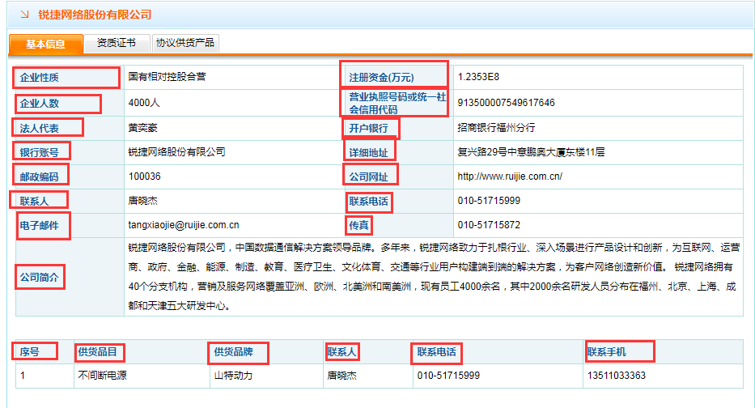

# kh简易教程

> ### <font color="yellow">首先</font>你需要安装一个[Anaconda](https://www.anaconda.com/download/)，下载64位或者32位且python版本为3.6的anaconda，然后按照[安装教程](https://blog.csdn.net/u012318074/article/details/77075209)进行安装，然后kh.py所在目录。

> ### <font color="yellow">其次</font>修改lg.xlsx表格，将所需要的下面图片中的字段填入lg.xlsx中,顺带将所需要的公司名字填入lg.xlsx中。




在kh.py所在目录按住shift,单击鼠标右键。然后点击“在此处打开命令窗口”。输入：

```python
python kh.py

